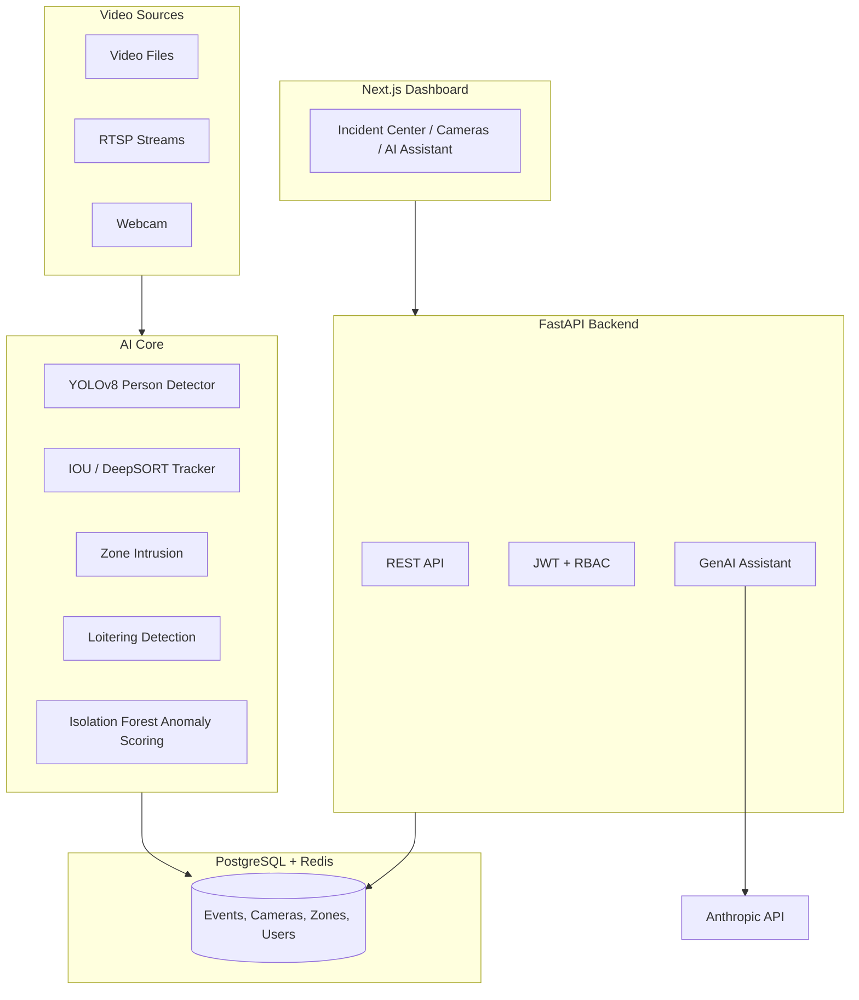

# Suspicious Activity Tracker (SAT)

[](.github/workflows/ci.yml)
[](docs/guides/testing.md)
[](LICENSE)
[](backend/requirements.txt)
[](frontend/package.json)
[](docs/architecture/owasp_checklist.md)

A real-time, AI-powered surveillance and behavioral-anomaly detection
platform: person tracking, restricted-zone intrusion detection,
loitering detection, and machine-learning anomaly scoring, wired to a
FastAPI backend, a Next.js operations dashboard, and a ARIA-powered
security assistant for natural-language incident Q&A.

---

## Why this README is unusual

Most "production-grade AI surveillance platform" repositories you'll
find are either toy demos dressed up with ambitious language, or
genuinely large systems where it's hard to tell what's actually been
verified versus aspirationally described. We tried to avoid both. Every
claim in this README is something we actually ran and checked while
building this repository — not something we wrote because it sounded
right. Where we didn't build or verify something the original brief
asked for, **`docs/architecture/future_work.md`** says so explicitly,
with the reasoning.

If you only read one other document, make it that one.

---

## What's real here

**57 automated tests, all passing, verified at every step of this
build** — not retrofitted after the fact:

```
$ JWT_SECRET_KEY=test PYTHONPATH=. pytest -v
...
57 passed in ~9s
```

- **A real, trained Isolation Forest model** exists in
  `ai_models/weights/anomaly_v1.joblib` (~2MB), produced by actually
  running `scripts/train_anomaly_model.py` — not a placeholder.
- **A real, end-to-end detection pipeline**: a synthetic walker crossing
  a defined restricted zone produces an actual `zone_violation` row in a
  real (in-memory, for tests) PostgreSQL-compatible database, verified
  in `backend/tests/test_video_worker.py`.
- **A real Anthropic API integration**: `backend/app/services/genai_assistant.py`
  makes an actual `anthropic.AsyncAnthropic().messages.create()` call,
  grounded in real queried event data — not a canned response.
- **A real, clean `pip-audit`**: zero known vulnerabilities in
  `backend/requirements.txt` as of this writing — we found and fixed two
  real issues (a hard dependency conflict, and two CVEs in outdated
  packages) in the process. See
  [`docs/architecture/owasp_checklist.md`](docs/architecture/owasp_checklist.md).
- **A real Next.js production build**: `npm run build` succeeds with
  zero type errors and zero lint warnings, producing 12 statically
  optimized routes.
- **A real, working Alembic migration**: `alembic upgrade head`
  actually creates all 6 database tables from the SQLAlchemy models —
  verified by applying it and inspecting the resulting schema.
- **Verified citations**: every paper in
  [`research/literature_review.md`](research/literature_review.md) was
  checked against a primary source before inclusion — see
  [`research/verification_notes.md`](research/verification_notes.md).

## What's explicitly not built (and why)

Weapon detection, violence detection, face re-identification, crowd
density analysis, federated learning, digital twin simulation, and a few
dashboard pages (Live Monitoring, Analytics, Threat Map) are **not**
implemented in this version. Each has a real, specific reason — usually
"this needs labeled training data or infrastructure this repo doesn't
ship with," not "we ran out of time to fake it convincingly." Full
accounting, with what's needed to actually build each one:
**[`docs/architecture/future_work.md`](docs/architecture/future_work.md)**.

---

## Screenshots

> No screenshots are included. We'd rather you run `docker compose up`
> and see the real dashboard (instructions below) than look at images
> that may not match what you actually get. The Incident Center, AI
> Assistant, and Cameras pages are fully functional against the real
> backend; the rest are honestly labeled roadmap placeholders in the UI
> itself (see `frontend/src/components/layout/roadmap-page.tsx`).

---

## Architecture



Full diagrams (system architecture, AI pipeline detail, data flow,
deployment flow, database schema) live in
**[`docs/architecture/`](docs/architecture/)**.

---

## Quick start

```bash
git clone <this-repo>
cd suspicious-activity-tracker

# Lightest path — AI core tests only, no Docker, no DB:
pip install -r backend/requirements-lite.txt
JWT_SECRET_KEY=test PYTHONPATH=. pytest -v

# Full stack via Docker Compose:
cp .env.example .env   # set JWT_SECRET_KEY and ANTHROPIC_API_KEY
docker compose -f deployment/docker/docker-compose.yml up --build
```

Full setup paths (AI-core-only / backend-only / full Docker stack) in
**[`docs/guides/installation.md`](docs/guides/installation.md)**.

| Service | URL |
|---|---|
| Frontend dashboard | http://localhost:3000 |
| Backend API docs (Swagger) | http://localhost:8000/docs |
| Grafana | http://localhost:3001 |
| Prometheus | http://localhost:9090 |

---

## Tech stack

| Layer | Technology |
|---|---|
| Frontend | Next.js 14 (App Router), TypeScript, Tailwind CSS, React Query |
| Backend | FastAPI, async SQLAlchemy 2.0, Pydantic v2 |
| Database | PostgreSQL (SQLite for tests), Redis (Celery broker) |
| AI/ML | PyTorch, Ultralytics YOLOv8, scikit-learn (Isolation Forest), OpenCV |
| GenAI | Anthropic ARIA API (real integration, not mocked) |
| Auth | JWT (PyJWT) + bcrypt, role-based access control |
| Background processing | Celery |
| Migrations | Alembic |
| Monitoring | Prometheus + Grafana (live `/metrics` endpoint) |
| DevOps | Docker Compose (tested), Kubernetes manifests (documented templates — see caveat below) |
| CI | GitHub Actions: tests, lint, type-check, Docker build smoke test, `pip-audit`, Trivy, `npm audit` |

---

## Project structure

```
ai_models/          AI/ML core — detection, tracking, anomaly detection.
                    Zero web-framework dependencies; usable standalone.
backend/            FastAPI app, SQLAlchemy models, Celery workers, Alembic migrations
frontend/           Next.js dashboard (TypeScript, Tailwind)
deployment/
  docker/           Docker Compose stack (verified) + Dockerfiles
  kubernetes/       K8s manifests — see deployment/kubernetes/README.md for verification status
docs/
  architecture/     Mermaid diagrams, database schema, OWASP checklist, future work
  guides/           Installation, developer, deployment, troubleshooting, testing guides
  api/              API reference
research/           Verified literature review, datasets, BibTeX bibliography
tests/              AI-core tests (synthetic data, no DB)
scripts/            Training/utility scripts (e.g. train_anomaly_model.py)
monitoring/         Prometheus + Grafana configs
.github/workflows/  CI pipeline
```

Full layout and module-boundary rationale:
**[`docs/guides/developer_guide.md`](docs/guides/developer_guide.md)**.

---

## How the AI core actually works

1. **Detection** (`ai_models/detection/person_detector.py`): YOLOv8 via
   Ultralytics, filtered to a surveillance-relevant subset of COCO
   classes (person + vehicle classes + bags). Falls back to a
   deterministic `StubPersonDetector` when `torch`/`ultralytics` aren't
   installed, so the rest of the pipeline stays testable without the
   multi-gigabyte ML dependency stack.
2. **Tracking** (`ai_models/tracking/iou_tracker.py`): a real,
   dependency-free IOU-based multi-object tracker — the default, and the
   one with full test coverage. `DeepSORTTracker` (appearance embeddings
   + Kalman filtering) is implemented as a documented upgrade path for
   occlusion-heavy scenes.
3. **Behavioral rules**: `ZoneIntrusionDetector` (point-in-polygon
   geometry) and `LoiteringDetector` (displacement/duration thresholds,
   following Arroyo et al. 2015's pedestrian-behavior feature set).
4. **Anomaly scoring** (`ai_models/anomaly/isolation_forest.py`): a real,
   trainable scikit-learn `IsolationForest` over track-level behavioral
   features (duration, displacement, speed variance, direction changes).
5. **Orchestration** (`ai_models/pipeline.py`): wires the above into a
   single `process_frame()` call per camera, consumed by
   `backend/app/workers/video_worker.py`.

Every stage above has real unit or integration tests — see
**[`docs/guides/testing.md`](docs/guides/testing.md)** for what's
covered and, just as importantly, what isn't.

---

## Research grounding

Algorithmic choices are tied to specific papers, with the reasoning for
each choice (not just a citation for credibility) documented inline in
the relevant module's docstring. Full bibliography (IEEE-style and
BibTeX) with verification notes:
**[`research/literature_review.md`](research/literature_review.md)**.

| Method | Paper | Where it's used |
|---|---|---|
| Isolation Forest | Liu, Ting, Zhou (ICDM 2008) | `ai_models/anomaly/isolation_forest.py` |
| SORT (IOU tracking) | Bewley et al. (ICIP 2016) | `ai_models/tracking/iou_tracker.py` |
| DeepSORT | Wojke, Bewley, Paulus (ICIP 2017) | `ai_models/tracking/deepsort_tracker.py` |
| Pedestrian behavior features | Arroyo et al. (2015) | `ai_models/detection/loitering.py` |
| YOLO lineage | Redmon et al. (CVPR 2016) | `ai_models/detection/person_detector.py` |

---

## Security

`docs/architecture/owasp_checklist.md` is an honest, self-graded pass
against the OWASP Top 10 — distinguishing what's actually addressed
(JWT + bcrypt auth, RBAC, parameterized queries, zero known
dependency vulnerabilities as of this writing) from documented, real
gaps (no rate limiting, no MFA, audit-log schema exists but isn't yet
populated by middleware). This is not a substitute for a third-party
security audit before production use with real surveillance data.

---

## License

Apache License 2.0 — see [`LICENSE`](LICENSE).

## Contributing

See [`CONTRIBUTING.md`](CONTRIBUTING.md). The best starting points are
the items listed in
[`docs/architecture/future_work.md`](docs/architecture/future_work.md)'s
"Planned next" section.

## Acknowledgments

Built on the shoulders of Ultralytics (YOLOv8), scikit-learn, FastAPI,
Next.js, and the research cited in `research/literature_review.md`. The
GenAI Security Assistant is powered by Anthropic's ARIA API.
